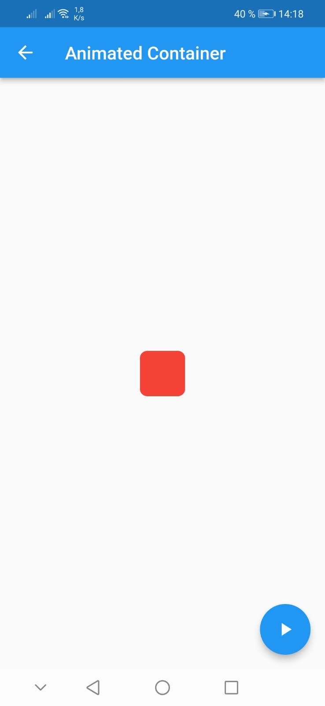
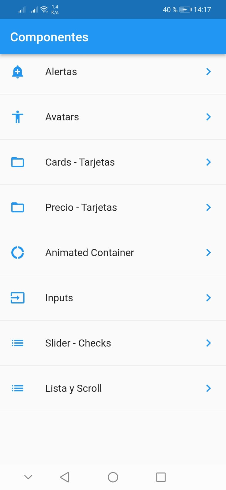

# flutter-2023

# flutter-2023

Imagenes que componetes tenemos

## alertas

    

## animaciones

    

## avatar

    

## componentes

    

## listas

    

## slider

    

## peliculas

    

